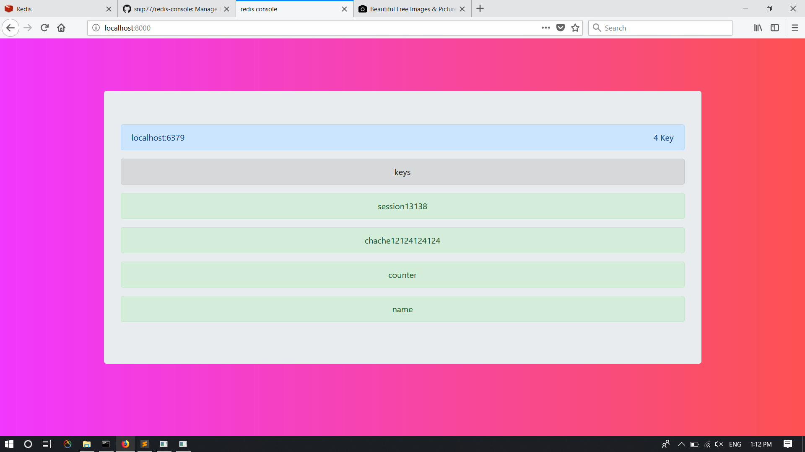

# redis-console
Manage Redis server keys


## Features :
  - see all keys
  - see record detail
    - types
      - Strings
  - search for match keys
  - edit keys
    - types
      - string
  - delete keys
  - insert record
    - types
      - Strings
      - Lists
      - Hashs
      - Sets
    - set expire time
    
    

### requirments
#### Redis
  
      Install redis from https://redis.io/download for you os
 #### Php
  
      You should have php for start server


## Installation :

###   Use composer:
   If you don't have Composer yet, download it following the instructions on http://getcomposer.org/ or just run the following command:

```php
    curl -s http://getcomposer.org/installer | php 
```
  Then, use the `create-project` command to generate a new application:
  
 ```php
    composer create-project snip77/redis-console -s dev path/to/install
 ```
 #### Composer will install the Beanstalk Console and all its dependencies under the `path/to/install` directory.
 
### setup host and port :
  for set up you should go to ```config.php``` in root directory :
  
##### host : change host variable value to your host(default is localhost) :
```php
        private $host='localhost'; 
```
      
####  port  : change port variable value to your redis port inyour host(default port for redis is 6379)

```php
        private $port=6379;
```

### Use :

  - run this command in main directory
    
```php
    Php -S localhost:8000
```
  - Visit `localhost:8000` in your browser
  
## requirments for use :
  
  - runs redis server
