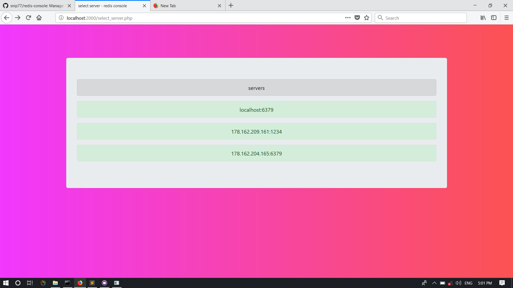

<h1 align="center" >redis console</h1>
<p align="center">
    <a href="LICENSE" target="_blank">
        
    </a>
    <a href="https://packagist.org/packages/redis-console/redis-console" target="_blank">
        
    </a>
    <a href="https://packagist.org/packages/redis-console/redis-console" target="_blank">
        
    </a>
    <a href="https://php.net/" target="_blank">
        
    </a>
    <a href="https://http://redis.io/" target="_blank">
        
    </a>
    <a href="https://github.styleci.io/repos/146747083">
        
    </a>
    <a href="https://www.codefactor.io/repository/github/snip77/redis-console">
        
    </a>
    <a href="https://bettercodehub.com/results/snip77/redis-console">
        
    </a>
</p>

### server list page :


## Features :
  - see all keys
  - see record detail
    - types availble
      - Strings
      - lists
      - sorted lists
      - sets
      - hashs
  - search for match keys
  - edit keys
    - types
      - string
  - delete keys
  - insert record
    - types  availble 
      - Strings
      - Lists
      - Hashs
      - Sets
      - sorted lists
    - set expire time
    
    

## Requirments
#### Redis
  Install redis from https://redis.io/download for your os
      
 #### Php
  Install from http://php.net/downloads.php


## Installation :

###   Use composer:
   If you don't have Composer yet, download it following the instructions on http://getcomposer.org/ or just run the following command:

```php
    curl -s http://getcomposer.org/installer | php 
```

  Then, use the `create-project` command to generate a new application:
  
 ```
    composer create-project redis-console/redis-console -s dev path/to/install
 ```
 
 #### Composer will install the redis Console and all its dependencies under the `path/to/install` directory

## OR

### install manually
    
   #### clone project from github with this command :
```php
    git clone https://github.com/snip77/redis-console.git
```
   #### install requirements with this command:
```php
    composer install
```

### setup host and port :
  for set up you should go to ```db.yaml``` in  config directory :
  
## Use :
  #### use default port:
  Default port for app is `2000`
  - run this command in main directory
    
```php
    php serve
```  

  - Visit `localhost:2000` in your browser
  
  #### set option port:
   You can set port like this:
```php
php serve PORT_NUMBER
``` 
  - Visit `localhost:PORT_NUMBER` in your browser
  
  For example 
 
 ```php
php serve 2010
``` 
  - Visit `localhost:2010` in your browser
  
  
## requirments for use :
  
  - redis server
